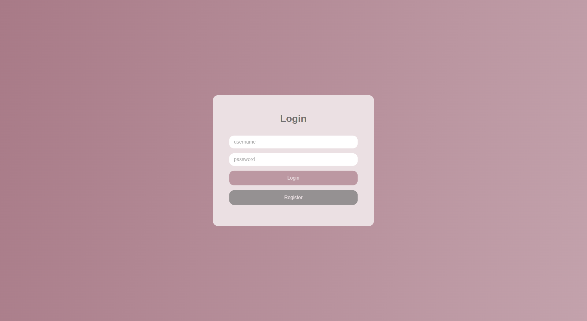
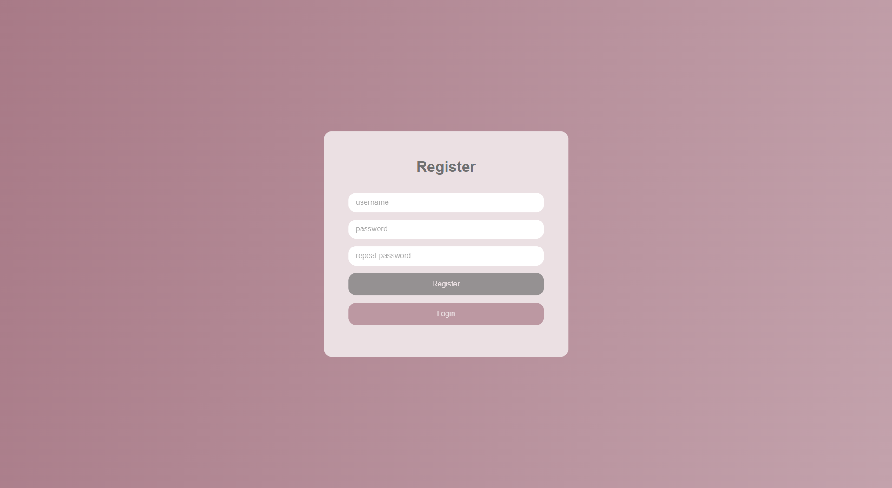
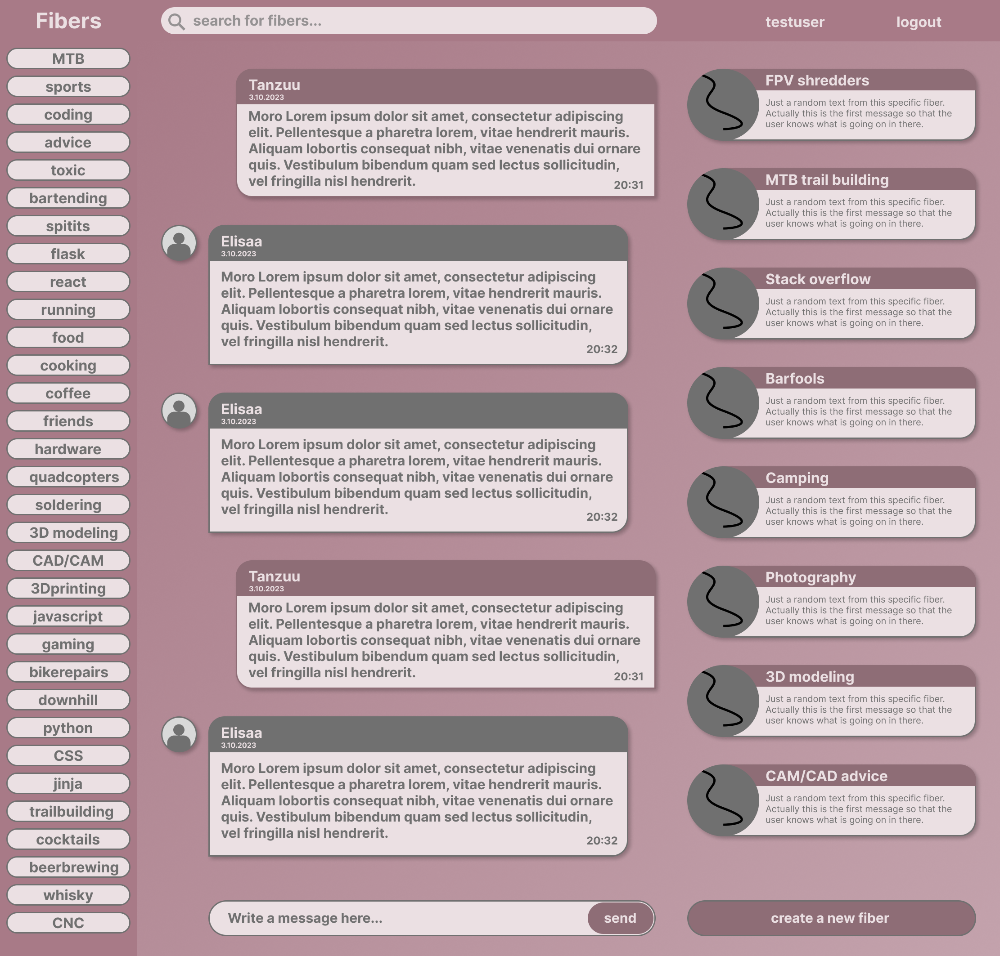
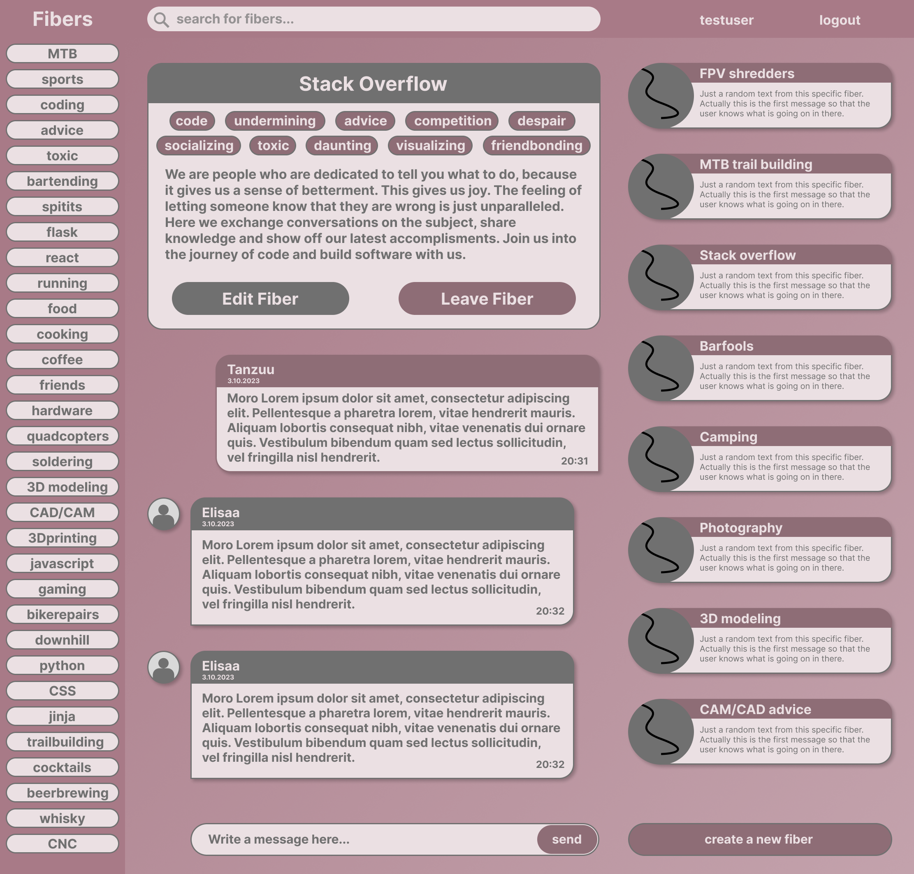
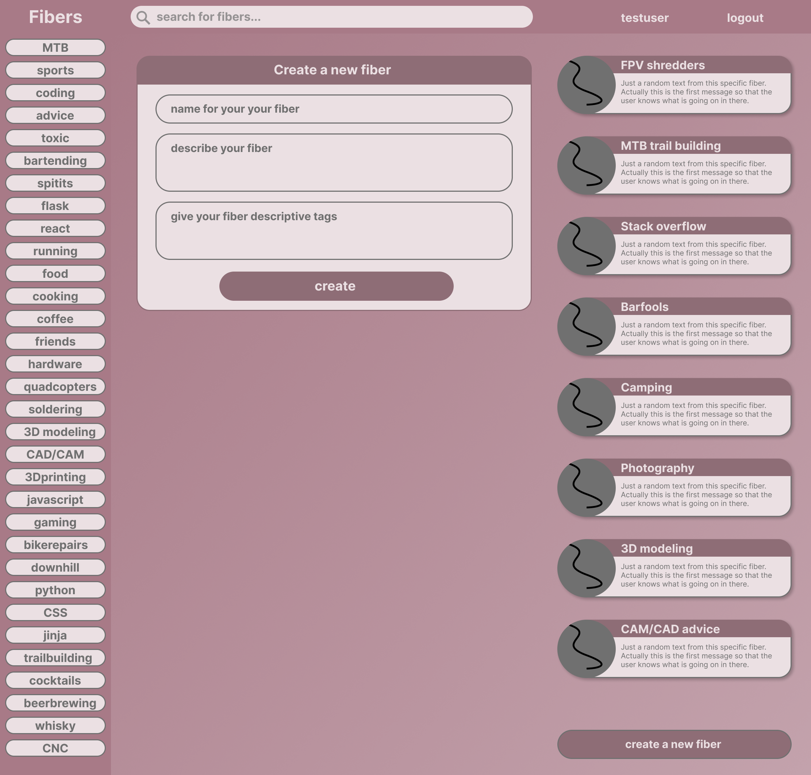
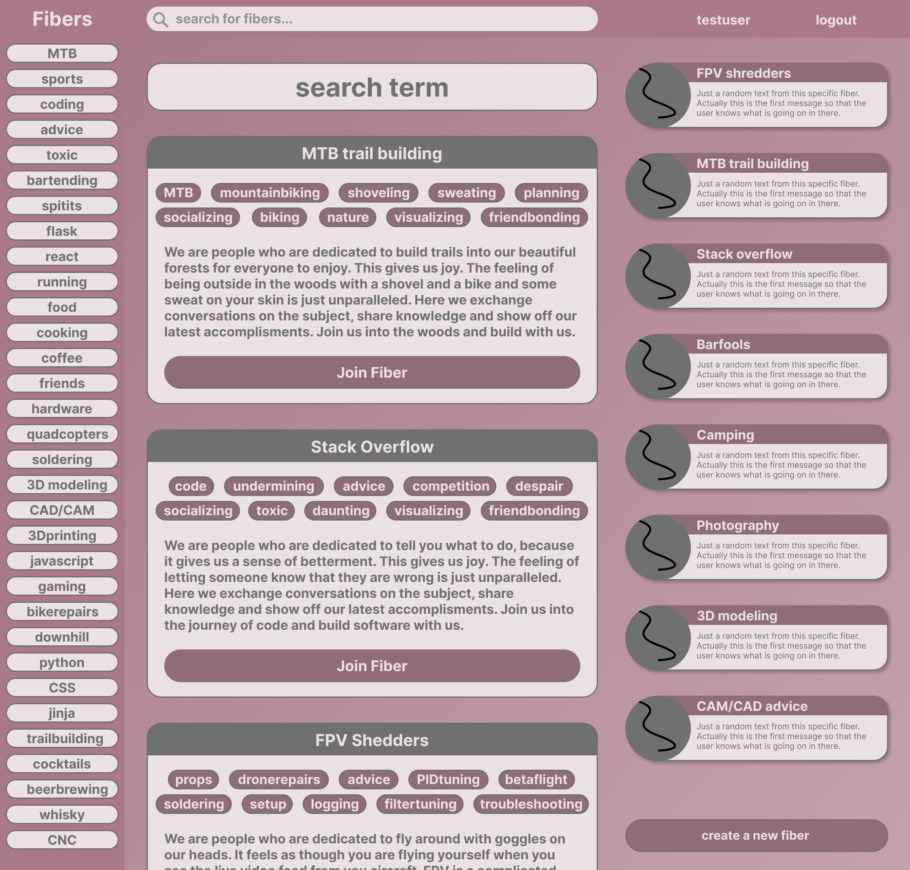

# Fibers
A small flask/python test web-app for Helsinki Uni project course "Database and web-programming"

Fibers is a web-app that allows its users to communicate in discussion-threads called fibers. 
A fiber is a communication space that is bound by a topic and is also tagged with useful labels 
that describe the contents of the fiber.

Users can join different fibers based on their interests. The fibers a user is following 
are found on the right side navigation bar on the application front page. User can browse for fibers 
to join through a search feature found on the top navigation bar, where one can search for fibers 
based on a word search that is matched against each fibers name, its description and tags. User can 
also follow tag links found in every fiber, and listed on the left side navigation bar.

Discussion inside a fiber progresses in a time-linear fashion. Newest posts are found at the top of 
the page, and they get older when scrolling down. User can create and send a text-based post to the 
fiber, and it will take its place on it based on the time it has been sent.

If there is is time (edit: there wasn't..), I would love to try to make some extra features too:
  - I would like to make adding photos to the posts in addition to text 
    content possible too
  - Make it possible for users to at least delete, or even modify posts
    that they have attached to the fiber
  - Try making some sort of feed-feature to the front page. Either 
    just a cronological list of individual posts from the fibers a user
    is following, or maybe a peak hole to the fibers that has most recent 
    activity in it. Let's see

# Current State of Project
The project is ready to the point that I had time to develop it during the confines of the course. 
There is a sign in functionality that lets you create a simple user account for the app and sign in. 
Once signed in, you can create fibers and give them a description, and descriptive tags. You are now 
the owner of this fiber.

The tags that you added to the fiber act as handles to the fiber, and others 
can find your fiber throught them. A set of all known tags in the application are listed on the left 
navigation bar in the UI and tags related to the fiber are found in the fiber-headings of each opened 
or listed fiber. By clicking a tag you get to see a list of all fibers associated with that tag. 

There is currently no smart limitation to listed tags or fiber, the application lists every tag and 
fiber it knows about. This is suboptimal, so keep this in mind when testing. I was supposed to do a 
scroll activated loading, but there wasn't enough time.

However once the fibers are listed, here you can join to other peoples fibers that you find interesting. 
When you join a fiber, you can now chat with people in the fiber, and only members of that fiber see 
your messages. 

Once you feel you want to exit the fiber, you can do so by pressing the "Leave Fiber"-button in the 
fiber-heading area on the top of the opened fiber. This will remove you from the members, but will not 
delete your messages from the fiber. If you are the only member of the fiber and decide to leave it, then 
all of its contents are deleted too, including also every tag that does not point to other fibers. 
After this the fiber is not able to be found through search and is not recoverable.

There is also an "Edit Fiber"-button that doesn't work at the moment. This feature took longer than 
expected to finish, but I will try to get it finished as soon as possible, but it doesn't quite make 
it to the deadline on midnight 22.10.23.

The application is not running anywhere online, so you will have to download it, and run it locally.

# How to run the app on your Computer
The application runs on python 3, so it will run on different operating systems, but this 
install guide will show you the process on Ubuntu-linux with superuser.

You can dowload and uncompress the zip-file directly, or you can use Git to download the package.

If you choose to use Git, you must install Git first

```sudo apt-get update && sudo apt-get install git```

Next clone the Fibers repository to a suitable location on your machine using Git

```git clone https://github.com/xTanzu/Fibers.git```

Now go inside the created folder called "Fibers", this is the root of the package

Now we need to install Python3

```sudo apt update && sudo apt install python3```

And in the root of our package right inside the "Fibers" folder, lets create a virtual environment with venv

```python3 -m venv .venv```

From the same location, we'll activate the virtual environment

```source .venv/bin/activate```

We now have an active virtual environment. From the same location, install all the required dependencies listed in requirements.txt

```pip install -r requirements.txt```

Now we have to install and setup PostgreSQL database, and there is a small script for that (using superuser privileges). Run it from the same location.

```./init_db.sh [-i|r|u]```

If you have PostgreSQL already installed, you need to still run the script so it will create the user and database with the required tables that the application will use.
The script works with three flags -i|r|u.
- i-flag for installing postgres using superuser
- r-flag for resetting existing database
- u-flag for creating required roles and granting privileges

For example:
- new installs use ./init_db.sh -iu
- for resetting database use ./init_db.sh -ru

Because I have used WSL on Windows to upload the files, the init_db.sh file may have insufficient privileges after cloning the package to your system and will have to be modified. If you have these problems with permissions, use ``chmod 777 init_db.sh`` to grant full privileges to all groups.

There is also a file in the root called postgresql_quide.txt to help you start and stop the postgreSQL service and remove it from your system when you dont need it anymore.

Now we have everything we need and we can start the flask development server from the same location, which is the root of the package right in the "Fibers" folder.

```flask --app src/app.py run```

Now the application is running on localhost port 5000. You can view it in the browser by typing in ``http://localhost:5000``


# How to use the application
Here is a breaf overview of the functionality of the application. All pictures but the login/register views are from a mockup file in Figma, so they are more conceptual, but illustrate the structure still very well. The running app looks pretty much the same.

## Login
You can enter your registered username and password to the form on login view when you open the site. This will log you in to the system and let you further.



## Registration
If you don't have a username and password yet, you can register a pair in the registration view, which you can access from the login-views "register"button. When you have succesfully registered, you will automatically be logged in to the system and forwarded to your main view.



## Main view
When you are logged in, you will be directed to the main view. Here you can see the most recent messages of all your fibers in chronological order from top to bottom, top being the newest. Here you have all the posts from different fibers mixed up in one list.



This same layout is consistent on every view. You have:
- top navigation bar above the content which consists of
  - "logo" which is a link back to this main view
  - search bar where you can make word-searches to search for word matches in fibername, description and tags of all the fibers in the database
  - username of the currently logged in user
  - logout link that lets you log off the system
- left navigation bar, that lists all the currently known tags in the system. By clicking these tags, you will be shown a match list of all the fibers sharing that specific tag.
- right navigation bar, that lists all the fibers that you are a member of currently. Listing items have the name of the fiber and a breaf description that is capped off if it doesn't fit in the area. There is also a circular placeholder for a personal picture for the fiber, but since time ran out I wasn't able to finish this functionality in time, but the placeholder is still there.
- main content area in the center, that will show different content based on which page you are currently on.

## Fiber view
When you choose a fiber either from the right navigation menu, or from the search results, you will be directed to this view. Here you have the contents of the fiber listed. There is:
- fiber heading area at the top that shows you the name of the fiber, the description given to it, and the descriptive tags list. You can click through the tags to perform the same tag-search that you can do using the left navigation menu.
- message area in the middle that lists you the recent messages posted on this particular fiber in chronological order from top to bottom just like in the main view
- message input field in the bottom, through which you can send new messages to the fiber. The message input field is fixed to the lower part of the page.



## New Fiber view
You can reach this view from the "add new fiber" button from the bottom righthand corner of every screen. Here you can create a new fiber for yourself. You give your fiber a name (a topic usually, but it can be whatever you like), a description that describes the point or topic of your fiber, and tags that also describe you fiber in a single word. You can use the same words in the tags as you use in the description. The tags funtion as handles to your fiber through which users can traverse to find new interesting fibers. You enter the tags as text separated by spaces. The application cuts the text into words that it uses as tags based on the spaces. 

Try to be descriptive here so other people can easily make the destinction if they want to join your fiber or not. 



## Search results view
When you click a tag in the left navigation menu or in a fiber header, or perform a word search, you will be forwarded to this search results view that lists fiber matches. Here you will see a list of all the fibers that match your search. Fibers are listed as fiber heading elements where you have similar information about the fibers as displayed on the heading of the fiber view. Here you also have clickable tags to navigate further to a new search results view based on a new tag.



# Enjoy :D
Hope you like my little app. I used so much time into this and learned so much. This is my largest project so far and would really like to get it online once it is in decent functioning condition.

I would really like some feedback on improvements if you have any. Feel free to suggest features, bugfixes and improvements, or just general critique, but in a constructive spirit of course. I am very much still a newb trying to progress.

